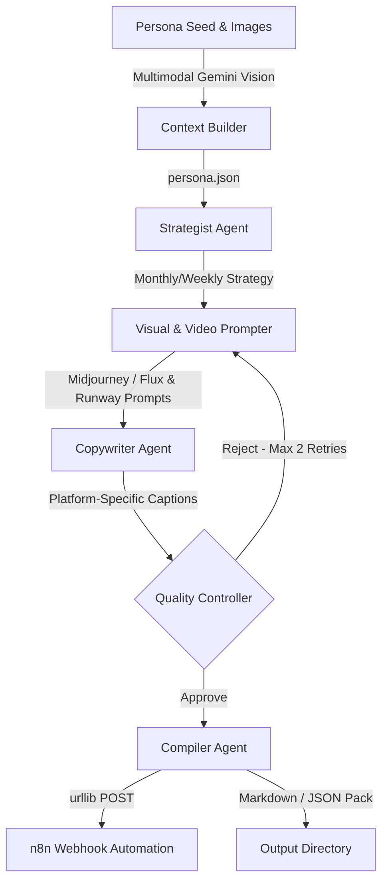
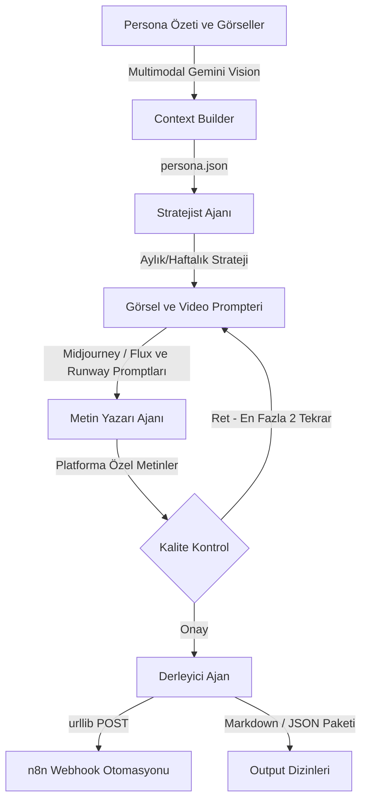

# Influencer Factory v1.5 🏭

--------------------------------------------------------------------------------

[](https://www.python.org/)
[](https://github.com/langchain-ai/langgraph)
[](https://deepmind.google/technologies/gemini/)
[](https://streamlit.io/)
[](https://n8n.io/)

> 🌐 **Autonomous Multi-Agent AI Marketing & Content Factory**
>
> <div align="center">
>   <h3>
>     <a href="#-english">🇬🇧 English</a> | 
>     <a href="#-türkçe">🇹🇷 Türkçe</a>
>   </h3>
> </div>

--------------------------------------------------------------------------------

<a name="-english"></a>
## 🇬🇧 English

**Influencer Factory** is an elite, autonomous multi-agent pipeline designed to handle the complete social media strategy, visual styling, video directives, and copywriting workflow for artists and digital influencers. Utilizing a LangGraph-powered stateful agent structure and Gemini 2.5 Flash, it translates simple artist seeds into massive, automation-ready monthly content packages.

### 📐 Multi-Agent Pipeline Architecture



---

### 🌟 Key Features

*   **Stateful Multi-Agent Network:** 6 specialized LangGraph agents working in a structured pipeline with feedback loops and autonomous Quality Control.
*   **Multimodal Persona Loader:** Integrates Gemini Vision to inspect artist photos, extract facial details, fashion choices, and aesthetic styles, generating structured metadata.
*   **Streamlit Web Dashboard:** An elegant, dark-themed UI to inspect and search persona archives, campaign calendars, and final social media markdown files in real-time.
*   **n8n Webhook Integration:** Directly triggers webhook automations with generated assets, caption copy, and reference media, allowing instant publishing.
*   **Aesthetic Image Prompting:** Prompter agents are enforced to generate highly cinematic and retro realism cues (e.g., disposable camera, 35mm film, flash photography, candid shots) avoiding plain generic AI renders.

---

### 🛠️ Tech Stack

*   **Framework:** LangGraph (Stateful Agent Workflows)
*   **AI Engine:** Gemini 2.5 Flash / Gemini 2.5 Flash-Lite (Google GenAI Bridge with Key Rotation & Rate-Limit Backoff)
*   **CLI Interface:** Rich & InquirerPy (Interactive Dark/Gothic UI)
*   **Web Interface:** Streamlit & Pandas (Tabular & Calendar views)

---

### 🚀 Setup & Installation

1.  **Clone the Repository:**
    ```bash
    git clone https://github.com/umutardaayhan/InfluencerFactory.git
    cd "Influencer Factory"
    ```
2.  **Install Dependencies:**
    ```bash
    pip install -r requirements.txt
    ```
3.  **Configure Environment Variables:**
    Create a `.env` file in the root directory based on `.env.example`:
    ```env
    GEMINI_API_KEYS=your_first_gemini_key,your_second_gemini_key
    N8N_WEBHOOK_URL=https://your-n8n-instance/webhook/etc
    ```

---

### 🎮 How to Run

*   **Start the Interactive CLI Wizard:**
    ```bash
    python main.py
    ```
*   **Launch the Streamlit Analytics Dashboard:**
    ```bash
    streamlit run dashboard.py
    ```

--------------------------------------------------------------------------------

<a name="-türkçe"></a>
## 🇹🇷 Türkçe

**Influencer Factory**, sanatçılar ve dijital influencer'lar için sosyal medya stratejisini, görsel tarzı, video direktiflerini ve metin yazarlığı iş akışını uçtan uca yöneten otonom bir çoklu ajan (multi-agent) üretim fabrikasıdır. LangGraph tabanlı durum yönetimi (stateful) ve Gemini 2.5 Flash gücünü birleştirerek, basit bir sanatçı özetini (seed) otomasyona hazır aylık içerik paketlerine dönüştürür.

### 📐 Çoklu Ajan Boru Hattı Mimarisi



---

### 🌟 Öne Çıkan Özellikler

*   **Durum Yönetimli Ajan Ağı:** Geri bildirim döngüleri ve otonom Kalite Kontrol (QC) mekanizması içeren 6 uzman LangGraph ajanının uyumlu çalışması.
*   **Multimodal Persona Yükleyici:** Gemini Vision ile sanatçı fotoğraflarını tarayarak yüz detaylarını, giyim tercihlerini ve estetik tarzı yapılandırılmış metadata haline getirir.
*   **Streamlit Web Paneli:** Personaları, kampanya takvimlerini ve üretilen sosyal medya metinlerini gerçek zamanlı izlemek ve aramak için tasarlanmış şık, koyu temalı web arayüzü.
*   **n8n Webhook Entegrasyonu:** Üretilen metinleri, görsel promptlarını ve referans görselleri tek tıklamayla n8n otomasyonuna ileterek doğrudan yayına hazırlar.
*   **Estetik Görsel Prompt Yapısı:** Yapay zeka promptları oluşturulurken sıradan yapay zeka çıktılarının önüne geçmek için dönemsel ve gerçekçi detaylar (kullan-at kamera, 35mm film, flaşlı çekim vb.) zorunlu kılınmıştır.

---

### 🛠️ Kullanılan Teknolojiler

*   **Altyapı:** LangGraph (Stateful Agent Workflows)
*   **Yapay Zeka:** Gemini 2.5 Flash / Gemini 2.5 Flash-Lite (Anahtar Rotasyonu ve Rate-Limit Korumalı Gemini Altyapısı)
*   **CLI Wizard:** Rich ve InquirerPy (Etkileşimli Dark/Gothic Terminal Arayüzü)
*   **Web Dashboard:** Streamlit ve Pandas (Excel ve Tablo Görünümü)

---

### 🚀 Kurulum ve Çalıştırma

1.  **Projeyi Klonlayın:**
    ```bash
    git clone https://github.com/umutardaayhan/InfluencerFactory.git
    cd "Influencer Factory"
    ```
2.  **Bağımlılıkları Yükleyin:**
    ```bash
    pip install -r requirements.txt
    ```
3.  **Çevre Değişkenlerini Ayarlayın:**
    Ana dizinde `.env.example` dosyasını referans alarak bir `.env` dosyası oluşturun:
    ```env
    GEMINI_API_KEYS=birinci_gemini_anahtari,ikinci_gemini_anahtari
    N8N_WEBHOOK_URL=https://n8n-adresiniz/webhook/etc
    ```

---

### 🎮 Çalıştırma Yöntemleri

*   **Etkileşimli CLI Sihirbazını Başlatın:**
    ```bash
    python main.py
    ```
*   **Streamlit Dashboard Arayüzünü Açın:**
    ```bash
    streamlit run dashboard.py
    ```
